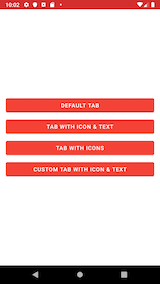
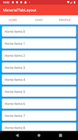
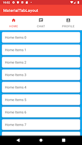
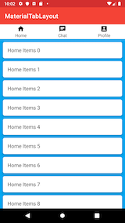

# MaterialTabLayout

Material Tab Layout Example

See the tutorial

 * [https://www.androhub.com/android-material-design-working-tabs-advanced/](https://www.androhub.com/android-material-design-working-tabs-advanced/)

